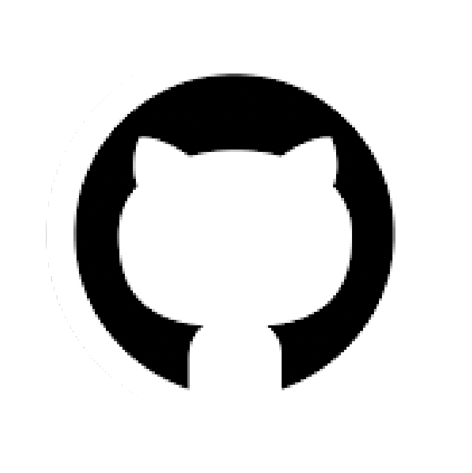
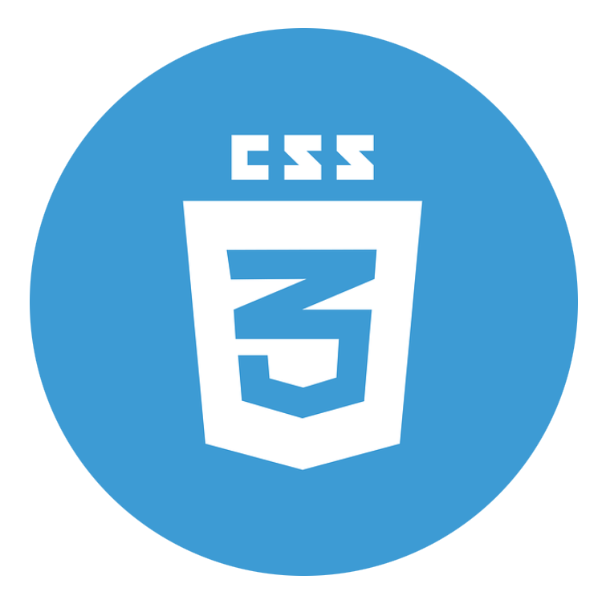
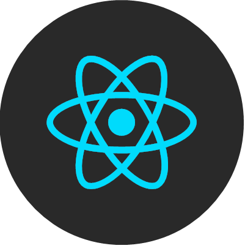

&nbsp;&nbsp;
&nbsp;&nbsp;

Welcome to my GitHub profile! I'm a Valencian **web developer** based in Madrid (Spain). who has recently switched career paths to one of their other passions, Web Development. This change has been possible thanks to **Ironhack Madrid**.

- 🌱 I’m currently expanding my knowledge learning React Hooks and Redux.
- 👯 As for now I’m looking to collaborate wherever I can be of help or learn something new.
- 💬 Ask me about Coding, Filmmaking, Videogames, Paella...

## Skills

&nbsp;&nbsp;
&nbsp;&nbsp;
&nbsp;&nbsp;
&nbsp;&nbsp;
&nbsp;&nbsp;
&nbsp;&nbsp;
&nbsp;&nbsp;
&nbsp;&nbsp;
&nbsp;&nbsp;
&nbsp;&nbsp;
&nbsp;&nbsp;

## My Github

